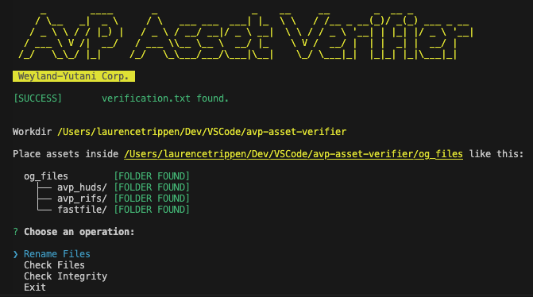

# AvP Asset Verifier

Renames & verifies MD5 of AvP asset files. 



### Usage

You have to run this program inside AvP's root directory.

```bash
$ npm i
$ npm start
```

### TODO

- [ ] Add Unit-tests
- [ ] Add avp game director path argument
- [ ] Add CI/CD GitHub-Workflow for npm deployment.
- [ ] Add TypeScript or just a bundler.
